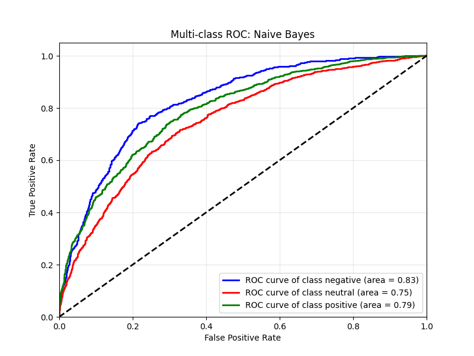
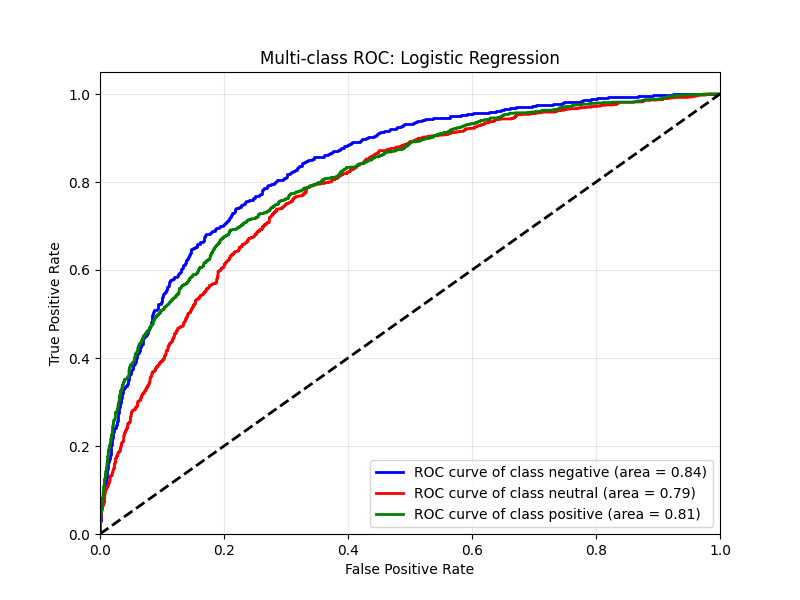
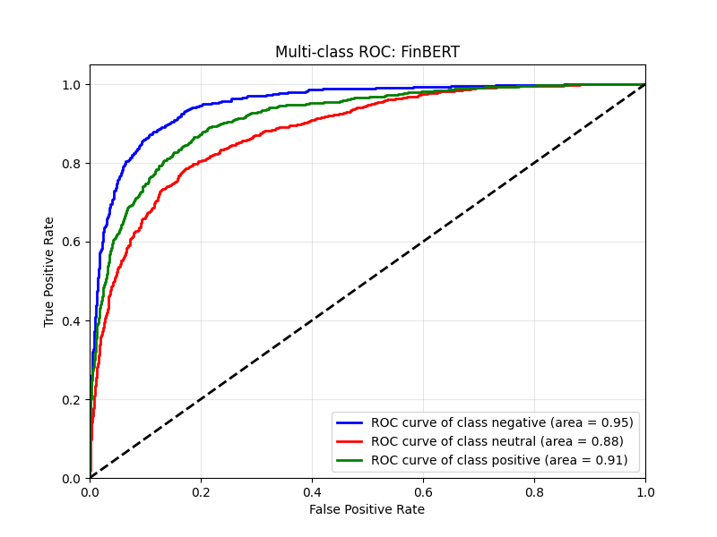
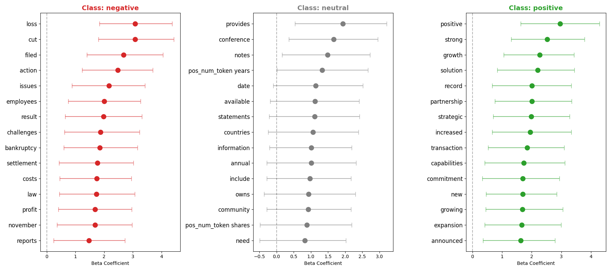
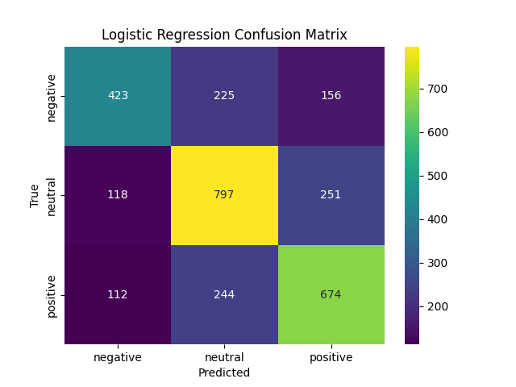
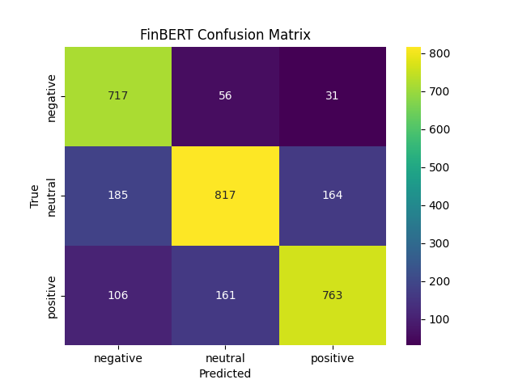

# Financial Sentiment Analysis: Bayesian Statistics vs. Transformers

> **Quick Summary:** A comparative study solving the "Black Box vs. Glass Box" dilemma in financial NLP. This project contrasts the raw predictive power of Large Language Models (**FinBERT**) against the interpretability of **Bayesian Logistic Regression** (MCMC) and the computation speed of **Naive Bayes** (SK-learn).
---
## 📊 Key Results: Accuracy vs. Interpretability

The results highlight a clear trade-off. **FinBERT** dominates in pure performance by understanding context, while the **Bayesian model** offers valuable business insights by quantifying exactly *which* words drive sentiment.

## 🏆 Key Results

The results highlight a clear trade-off. **FinBERT** dominates in pure performance by understanding context, while the **Bayesian model** offers valuable business insights by quantifying exactly *which* words drive sentiment.

| Model | Accuracy | F1-Score (Weighted) | ROC AUC (OvO) | Log Loss | Strength |
| :--- | :---: | :---: | :---: | :---: | :--- |
| **FinBERT (SOTA)** | **77%** | **0.77** | **0.92** | **0.57** | **Context Awareness** & Calibration |
| **Bayesian LogReg** | 63% | 0.63 | 0.81 | 0.81 | **Explainability** & Uncertainty Quantification |
| **Naive Bayes** | 60% | 0.60 | 0.79 | 0.97 | Fast Baseline |

### 1. Performance Visualization (ROC Curves)
*FinBERT (Right) achieves near-perfect separation for negative sentiment, significantly outperforming the statistical baselines.*

  
  
   

---

## 🛠️ Engineering Highlights

### 1. Advanced Feature Engineering (NLP)
Standard TF-IDF fails with numbers. I implemented a **custom tokenization pipeline** to preserve financial context before vectorization:
* **Problem:** Algorithms treat "5%" and "2024" as generic numbers.
* **Solution:** Regex substitution to specific tokens:
    * `+5%` $\rightarrow$ `POS_PERC_TOKEN` (Strong Positive signal)
    * `-10%` $\rightarrow$ `NEG_PERC_TOKEN` (Strong Negative signal)
    * `2024 / 40` $\rightarrow$ `POS_NUM_TOKEN` (Neutral / positive context)
  * `-20` $\rightarrow$ `NEG_NUM_TOKEN` (Negative context)

### 2. Bayesian Inference (PyMC)
Instead of a simple `sklearn.LogisticRegression`, I built a probabilistic model from scratch using **NUTS Sampler (MCMC)**.
* **Why?** To obtain probability distributions for feature weights rather than point estimates.
* **Validation:** Rigorous diagnostics including Trace Plots, R-hat convergence checks (< 1.01), and Posterior Predictive Checks (PPC).

### 3. Deep Learning (FinBERT)
Fine-tuned the `ProsusAI/finbert` model using **Hugging Face Trainer**.
* **Strategy:** Transfer learning with `eval_loss` checkpointing to prevent overfitting on the specific 15k-sample dataset.

---

## 🔍 "Glass Box" Interpretability

Why use the Bayesian model if FinBERT is more accurate? **Because we can explain it.**

The Forest Plot below reveals the **posterior distribution of weights**. Unlike a neural network, we can prove to stakeholders that words like `growth` or our custom `pos_perc_token` statistically drive positive classification, while `loss` drives negative classification.

---

## 📉 Error Analysis

The Confusion Matrix shows that while FinBERT is superior, the hardest task for all models is distinguishing **Neutral** from Positive sentiment. However, FinBERT minimizes critical errors (predicting Positive when the reality is Negative).

  
   

---

## 💻 Tech Stack
* **Core:** Python 3.12, Pandas, NumPy
* **Modeling:** PyTorch, PyMC, ArviZ, Scikit-learn
* **NLP:** Transformers (Hugging Face), NLTK/Regex
* **Viz:** Matplotlib, Seaborn

---

## 🎨 Concept: The Dilemma
*Visualization of the project's core conflict: The interpretable precision of Classical Statistics vs. the raw power of Black-Box Deep Learning.*

 

